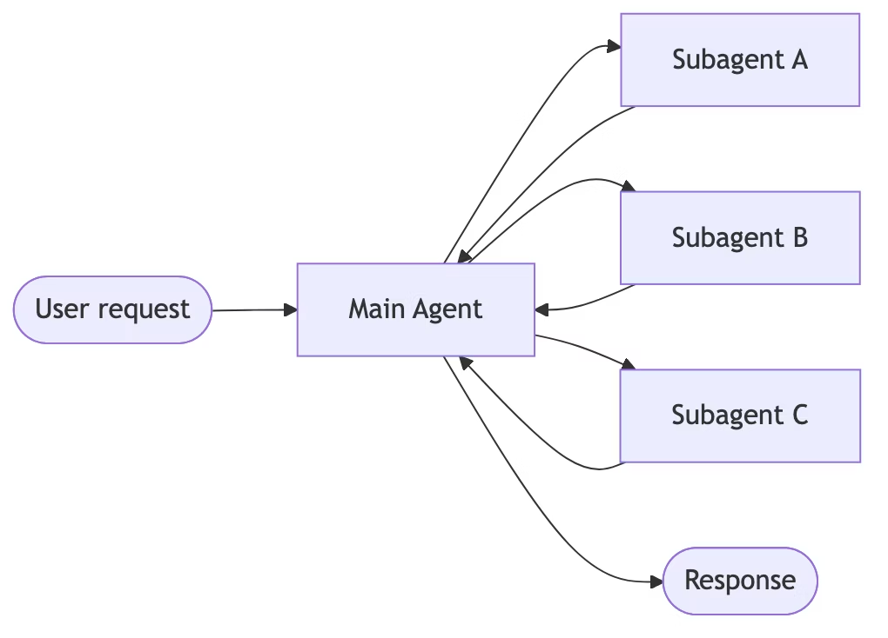
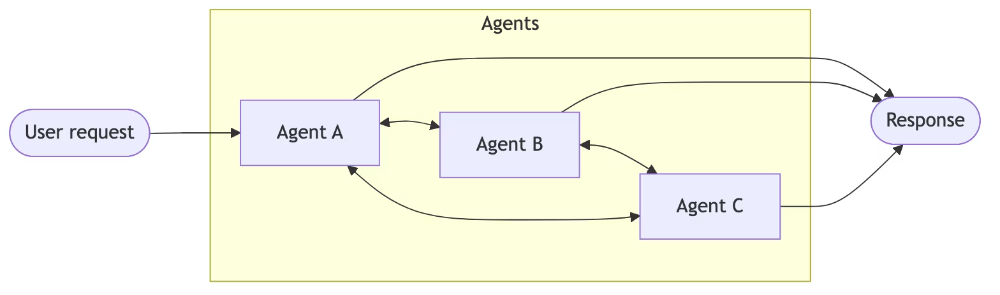
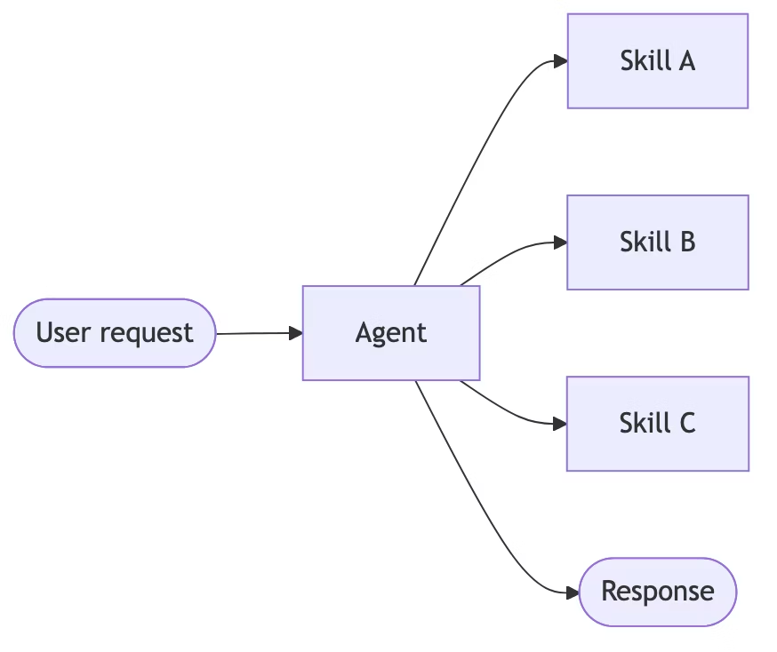

# Overview
## Why multi-agent? 
- 上下文管理 ：在不使模型上下文窗口过载的情况下提供专业知识。如果上下文无限且延迟为零，您可以将所有知识都塞进一个提示框中——但事实并非如此，您需要使用模式来有选择-地呈现相关信息。
- 分布式开发 ：允许不同的团队独立开发和维护功能，并将它们组合成一个具有清晰边界的更大系统。
- 并行化 ：为子任务生成专门的工作进程，并同时执行它们，以加快结果速度。

> 多智能体设计的核心是上下文工程 ——决定每个智能体能够看到哪些信息。系统的质量取决于确保每个智能体都能访问完成其任务所需的正确数据。

## Patterns  模式
请使用下表将您的需求与合适的模式（Pattern）进行匹配：

| 模式 (Pattern) | 分布式开发 (Distributed development) | 并行化 (Parallelization) | 多跳 (Multi-hop) | 直接用户交互 (Direct user interaction) |
|----------------|--------------------------------------|--------------------------|------------------|----------------------------------------|
| 次级代理商 (Subagents) | ⭐⭐⭐⭐⭐ | ⭐⭐⭐⭐⭐ | ⭐⭐⭐⭐⭐ | ⭐ |
| 交接 (Handoffs)        | -       | -       | ⭐⭐⭐⭐⭐ | ⭐⭐⭐⭐⭐ |
| 技能 (Skills)          | ⭐⭐⭐⭐⭐ | ⭐⭐⭐    | ⭐⭐⭐⭐⭐ | ⭐⭐⭐⭐⭐ |
| 路由器 (Router)        | ⭐⭐⭐    | ⭐⭐⭐⭐⭐ | -       | ⭐⭐⭐ |

- **分布式开发 (Distributed development)**：不同团队是否可以独立维护组件？
- **并行化 (Parallelization)**：多个代理是否可以同时执行？
- **多跳 (Multi-hop)**：是否支持按顺序调用多个子代理？
- **直接用户交互 (Direct user interaction)**：子代理是否可以直接与用户对话？

## Visual overview
### Subagents:
主代理协调子代理作为工具。所有路由都通过主代理。

### Handoffs:
代理之间通过工具调用进行控制权交接。每个代理都可以将控制权移交给其他代理，也可以直接响应用户。

### Skills:
单个代理程序可按需加载专门的提示和知识，同时保持控制。

### Router:
路由步骤对输入进行分类，并将其定向到专门的代理。最后，对结果进行综合分析。

## Performance comparison  性能比较
Key metrics: 
- **模型调用次数**：LLM 调用次数。调用次数越多，延迟越高（尤其是顺序调用），每次请求的 API 成本也越高。
- **已处理的令牌数** ：所有调用中上下文窗口的总使用量。令牌数越多，处理成本越高，潜在的上下文限制也越大。

场景:
- 对于单个任务（每个任务 3 次调用），交接、技能和路由​​效率最高。子代理会增加一次调用，因为结果会通过主代理返回——这种额外的开销提供了集中控制。
- 有状态模式（例如切换、技能）可以减少 40-50% 的重复请求调用。子代理保持每次请求成本的一致性——这种无状态设计虽然提供了强大的上下文隔离，但代价是模型调用次数的增加。
-  对于多域任务，并行执行模式（例如子代理、路由器）效率最高。技能调用次数较少，但由于上下文累积，令牌使用量较高。交接模式效率低下——它必须顺序执行，无法利用并行工具调用同时查询多个域。

| 优化目标 (Optimize for) | 次级代理商 (Subagents) | 交接 (Handoffs) | 技能 (Skills) | 路由器 (Router) |
|--------------------------|------------------------|-----------------|---------------|-----------------|
| 单次请求 (Single requests)        |                        | ✅              | ✅            | ✅              |
| 重复请求 (Repeat requests)        |                        | ✅              | ✅            |                 |
| 并行执行 (Parallel execution)     | ✅                     |                 |              | ✅              |
| 大上下文领域 (Large-context domains) | ✅                     |                 |              | ✅              |
| 简单、重点明确的任务 (Simple, focused tasks) |                        |                 | ✅            |                 |